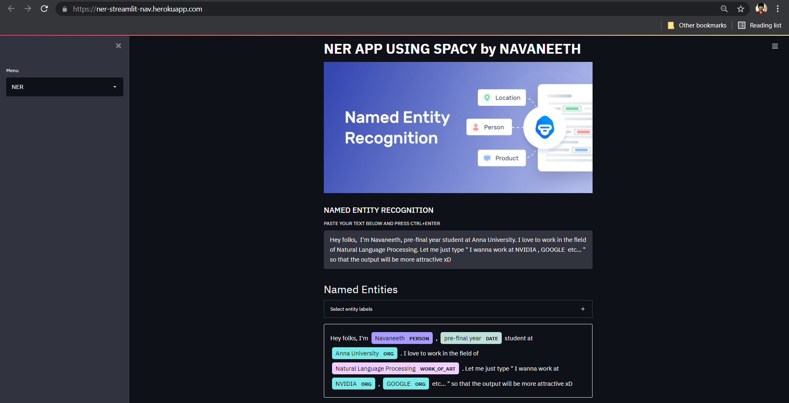

# <b>NER_STREAMLIT</b>
- A genreal purpose Named Entity Recognition model using Spacy.
- UI is guarded by Streamlit.
- This application was deployed to Heroku.
- Build pack to be added in Heroku : heroku/python
-  <strong><b> APP LINK : https://ner-streamlit-nav.herokuapp.com/</b></strong>
- The home page of the web app is shown below:

    

